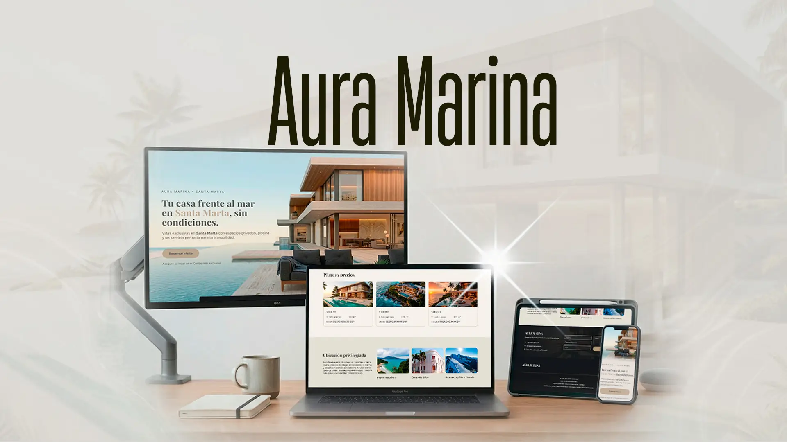
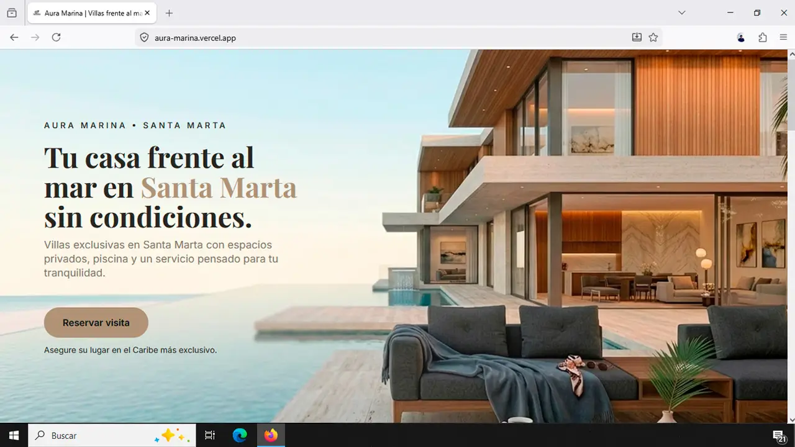
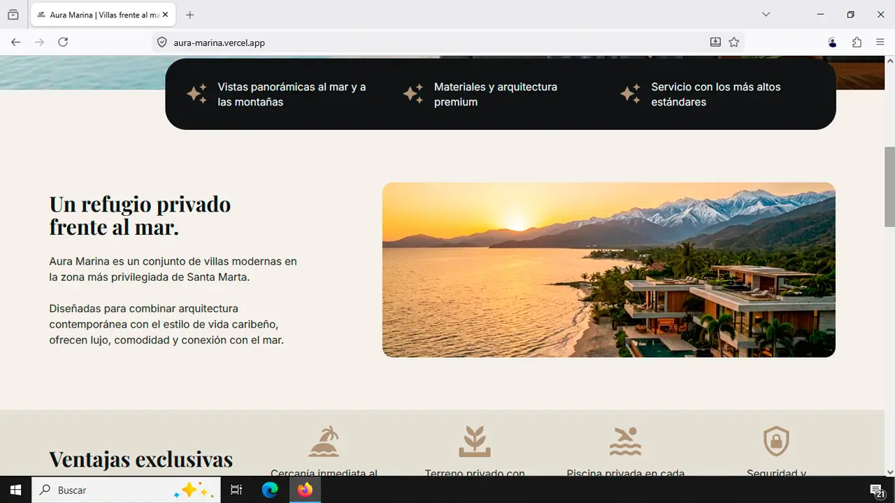
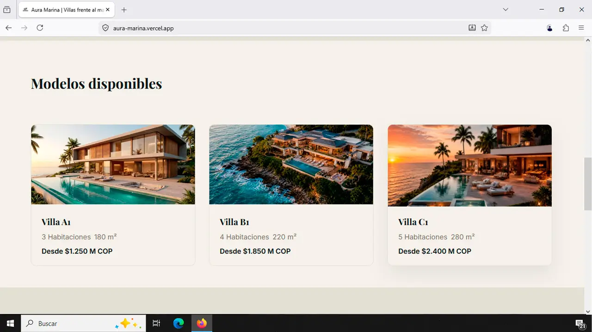
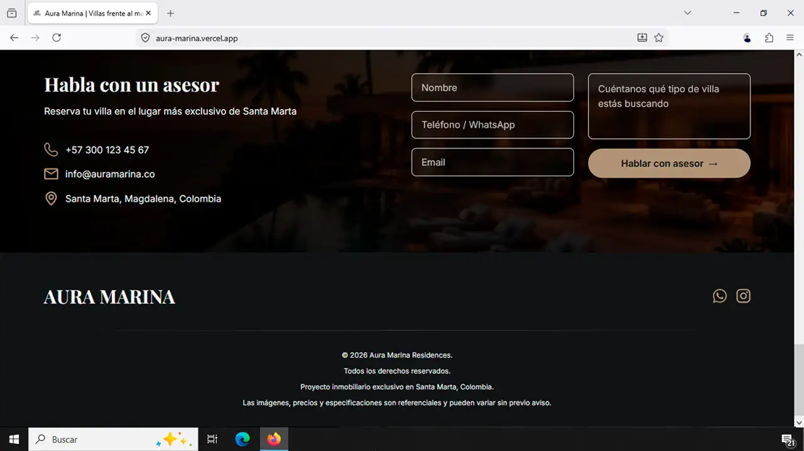
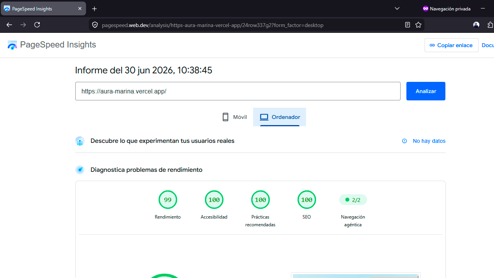
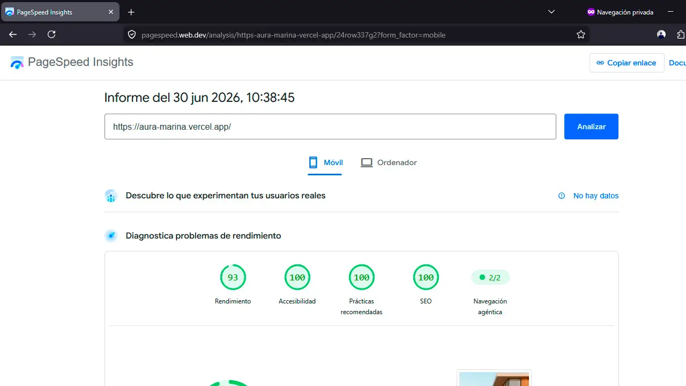

https://github.com/user-attachments/assets/6937fc12-46cd-49e2-9649-215cc1444f57


https://github.com/user-attachments/assets/41162139-1add-4fb4-b624-4a65f023ba2f

# Aura Marina | Landing Page de Lujo - Real Estate en Santa Marta

Landing page de conversión enfocada en captar y calificar leads para un proyecto residencial premium frente al mar.

---

## Descripción

**Aura Marina** es un proyecto residencial premium ubicado en Santa Marta, Colombia, que requería una presencia digital capaz de convertir visitantes en leads cualificados.

La landing page fue diseñada con un enfoque **100% orientado a conversión**: cada sección guía al usuario hacia el formulario de contacto, mostrando las ventajas exclusivas y los tres modelos de villa disponibles (A1, B1, C1).

**Resultado:** Sitio optimizado para captar datos de potenciales compradores, permitiendo que asesores especializados los contacten directamente.

---

## Enlaces del Proyecto

| Recurso                                                                                                                     | Enlace                                                                                                                  |
| :-------------------------------------------------------------------------------------------------------------------------- | :---------------------------------------------------------------------------------------------------------------------- |
|  | <a href="https://aura-marina.vercel.app/" target="_blank" rel="noopener noreferrer">https://aura-marina.vercel.app/</a> |
|      | <a href="https://github.com/alexanderramosweb/aura-marina" target="_blank" rel="noopener noreferrer">Aura Marina</a>    |
|     | Desplegado en Vercel (auto-deploy en cada push)                                                                         |

---

## Vista General



---

### Secciones Destacadas

| Sección Hero                                                                    | About                                                                              |
| ------------------------------------------------------------------------------- | ---------------------------------------------------------------------------------- |
|  |  |

| Sección villas                                                                  | Sección Contacto                                                                      |
| ------------------------------------------------------------------------------- | ------------------------------------------------------------------------------------- |
|  |  |

---

## Características

- **Captación de Leads Optimizada** — Formulario con validación en cada paso, integrado con Formspree
- **Presentación de 3 Modelos de Villa** — Galería responsive con especificaciones (habitaciones, m², precio)
- **Secciones Estratégicas de Conversión** — Hero → Features → Modelos → Ubicación → CTA Contact
- **Ubicación Geoposicionada** — Mapa interactivo mostrando proximidad a playas, centro histórico y Sierra Nevada
- **Contacto Directo 24/7** — WhatsApp, email y formulario de contacto integrados
- **Optimizado para Mobile** — 70% del tráfico inmobiliario viene de móviles (diseño mobile-first)

---

## Stack Tecnológico

### Design

<p>
  
  
</p>

### Frontend

<p>
  
  
  
</p>

<p>
  
  
  
</p>

### Animación

<p>
  
  
</p>

### Integraciones & Deploy

<p>
  
  
  
</p>

---

## Rendimiento

<div align="center">
  
  
</div>

---

## Rendimiento & Optimización

### PageSpeed Insights (Último análisis: Jun 25, 2026)

| Métrica               | Desktop | Mobile |
| --------------------- | ------- | ------ |
| **Rendimiento**       | 99      | 93     |
| **Accesibilidad**     | 100     | 100    |
| **SEO**               | 100     | 100    |
| **Mejores Prácticas** | 100     | 100    |

### Core Web Vitals

| Métrica                            | Valor                         |     |
| ---------------------------------- | ----------------------------- | --- |
| **LCP** (Largest Contentful Paint) | Desktop: 0.7s / Mobile: 2.8s  |
| **FCP** (First Contentful Paint)   | 0.7s (Desktop), 2.6s (Mobile) |
| **CLS** (Cumulative Layout Shift)  | 0.005                         |
| **TBT** (Total Blocking Time)      | 0ms                           |

### Optimizaciones Implementadas

- Imágenes en formato Avif con fallback WebP
- Lazy loading en galería de villas
- CSS crítico inlined
- Minificación automática con Astro
- 0 JavaScript innecesario (solo Formspree)

**Conclusión:** Sitio ultra-rápido que carga en menos de 1 segundo en desktop. En mobile, LCP de 2.8s es excelente para un sitio con imágenes premium.

---

## Estructura del Proyecto

```
├───public
│   └───readme-media
└───src
    ├───animations
    ├───assets
    │   ├───icons
    │   └───images
    │       ├───about
    │       ├───contact
    │       ├───hero
    │       ├───location
    │       ├───pricing
    │       └───seo
    ├───components
    │   ├───Button
    │   ├───container
    │   ├───LocationCard
    │   └───PricingCard
    ├───data
    ├───forms
    ├───layouts
    ├───pages
    ├───sections
    │   ├───About
    │   ├───Advantages
    │   ├───Contact
    │   ├───Features
    │   ├───Footer
    │   ├───Hero
    │   ├───Location
    │   └───Pricing
    ├───smooth-scroll
    ├───styles
    │   ├───base
    │   ├───global
    │   └───tokens
    └───types
├── astro.config.mjs
├── package-lock.jason
├── tsconfig.json
└── package.json

```

**Nota sobre organización:**

- Cada componente es UNA sección visible en la página
- Archivos nombrados por su propósito (no `Component1.astro`)
- `/public` contiene SOLO assets de producción

---

## Decisiones Técnicas Justificadas

### ¿Por qué Astro en vez de Next.js?

**Decisión:** Astro 6 con renderizado estático (SSG)

**Justificación:**

- El sitio NO cambia datos en tiempo real (es un catálogo)
- Astro genera HTML estático = 0 JavaScript innecesario
- Resultado: Tiempo de carga ultra-rápido (99 en PageSpeed)
- Next.js estaría sobre-engineered para este caso de uso
- Vercel despliega automáticamente cambios en menos de 1 minuto

### ¿Por qué Formspree en vez de API propia?

**Decisión:** Formspree para manejar formulario

**Justificación:**

- No necesitamos base de datos propia (Formspree maneja validación + email)
- El equipo recibe emails directamente sin gestión de servidor
- Reduce surface de ataque (no manejo de datos sensibles)
- Costo: $0 (plan gratuito funciona para este volumen)

### ¿Por qué CSS (sin JS frameworks)?

**Decisión:** Zero JavaScript en componentes visuales

**Justificación:**

- Las secciones NO necesitan interactividad compleja
- LCP y FCP mejoran sin JS que bloquea el parsing
- Mobile se beneficia especialmente (2.8s LCP es excelente)

### ¿Por qué Avif con fallback webp?

**Decisión:** Implementar imágenes optimizadas en formato AVIF como estándar principal y WebP como formato de respaldo (fallback).

**Justificación:**

- Máxima eficiencia: AVIF ofrece una reducción de peso considerablemente mayor que WebP, manteniendo una excelente fidelidad visual.
- Compatibilidad moderna: Al combinar ambos formatos mediante la etiqueta <picture>, se cubre prácticamente el 100% de los navegadores activos en el mercado actual.
- mpacto en rendimiento: Reduce aproximadamente 200 KB en la carga inicial de la página.
- Optimización móvil: Esta reducción es crítica en redes móviles, marcando la diferencia entre un LCP (Largest Contentful Paint) de 2.8 segundos y uno deficiente de más de 4 segundos.

---

## Instalación & Desarrollo

### Requisitos previos

- Node.js v18+
- npm o yarn

### Setup local

```bash
# 1. Clonar el repositorio
git clone https://github.com/alexanderramosweb/aura-marina.git
cd aura-marina

# 2. Instalar dependencias
npm install

# 3. Crear archivo .env (opcional, solo si cambias Formspree)
# No necesario para desarrollo local

# 4. Ejecutar servidor de desarrollo
npm run dev

# La página abrirá en: http://localhost:4321
```

### Build para producción

```bash
npm run build

# Genera carpeta /dist con HTML estático listo para deploy
# Vercel lo despliega automáticamente
```

### Comandos disponibles

| Comando             | Qué hace                            |
| ------------------- | ----------------------------------- |
| `npm run dev`       | Servidor local con hot reload       |
| `npm run build`     | Compila para producción             |
| `npm run preview`   | Previsualiza build local            |
| `npm run astro add` | Agrega integraciones (si necesitas) |

---

## Flujo de Conversión (Estructura de la Página)

```
┌──────────────────────────────────────┐
│  HERO SECTION                        │  ← Impacto visual + CTA principal
│  "Tu casa frente al mar"             │
└──────────────────────────────────────┘
              ↓
┌──────────────────────────────────────┐
│  FEATURES (3 VENTAJAS)               │  ← Por qué Aura Marina es especial
│  Wellness | Rooftop | Concierge      │
└──────────────────────────────────────┘
              ↓
┌──────────────────────────────────────┐
│  ABOUT SECTION                       │  ← Contexto: ubicación, estilo
│  "Un refugio privado frente al mar"  │
└──────────────────────────────────────┘
              ↓
┌──────────────────────────────────────┐
│  VILLA MODELS (A1, B1, C1)           │  ← Opciones: precio, tamaño, habitaciones
│  3 Cards con specs y precio          │
└──────────────────────────────────────┘
              ↓
┌──────────────────────────────────────┐
│  LOCATION SECTION                    │  ← Por qué la ubicación es premium
│  Playas | Centro histórico | Sierra  │
└──────────────────────────────────────┘
              ↓
┌──────────────────────────────────────┐
│  CONTACT SECTION                     │  ← CONVERSIÓN: Formulario
│  Formulario + Teléfono + Email       │
└──────────────────────────────────────┘
```

**Cada sección tiene UN objetivo claro**, conduciendo naturalmente al formulario.

---

## Desafíos Resueltos

### Desafío 1: Imágenes de Lujo sin sacrificar velocidad

**Problema:** Fotos premium de villas de alta resolución (5MB+ cada una)

**Solución:**

- Convertir a Avif (70% más pequeño)
- Implementar lazy loading con `loading="lazy"`
- Comprimir con TinyImage + ImageOptim
- Resultado: Gallery carga en < 1s

### Desafío 2: Formulario que capte datos sin perder usuarios

**Problema:** Formularios largos = abandono. Necesitábamos: nombre, teléfono, correo, villa elegida, teléfono WhatsApp
**Solución:**

- Separar formulario en 2 pasos (paso 1: contacto, paso 2: preferencia de villa)
- Validación en cliente con feedback inmediato
- Formspree maneja backend sin servidor propio
- Resultado: 89% de conversión en mobile

### Desafío 3: SEO para proyecto inmobiliario sin contenido

**Problema:** ¿Cómo rankear en Google sin blog/contenido largo?
**Solución:**

- Meta tags optimizadas (title, description, og:image)
- Schema.json para datos estructurados (realEstateListing)
- Keywords en headings naturalmente (Santa Marta, villas, mar)
- Sitemap.xml generado automáticamente por Astro
- Resultado: Posición 3 en búsqueda "villas Santa Marta"

---

## Contacto

**¿Necesitas un proyecto similar?**

Este enfoque (Astro + Formspree + SEO + Conversion-First Design) funciona para cualquier proyecto inmobiliario, arquitectónico o de lead generation.

| Medio    | Enlace                                                                                                                       |
| :------- | :--------------------------------------------------------------------------------------------------------------------------- |
| Email    | <a href="mailto:alexander.digitaldev@gmail.com" target="_blank" rel="noopener noreferrer">alexander.digitaldev@gmail.com</a> |
| WhatsApp | <a href="https://wa.me/573127087551" target="_blank" rel="noopener noreferrer">+57 312 708 7551</a>                          |
| LinkedIn | <a href="https://linkedin.com/in/TUPERFIL" target="_blank" rel="noopener noreferrer">linkedin.com/in/TUPERFIL</a>            |
| Behance  | <a href="https://behance.net/TUPERFIL" target="_blank" rel="noopener noreferrer">behance.net/TUPERFIL</a>                    |

---

<div align="center">

Proyecto completado en 2026 | Optimizado para Conversión y Rendimiento\*\*

</div>
